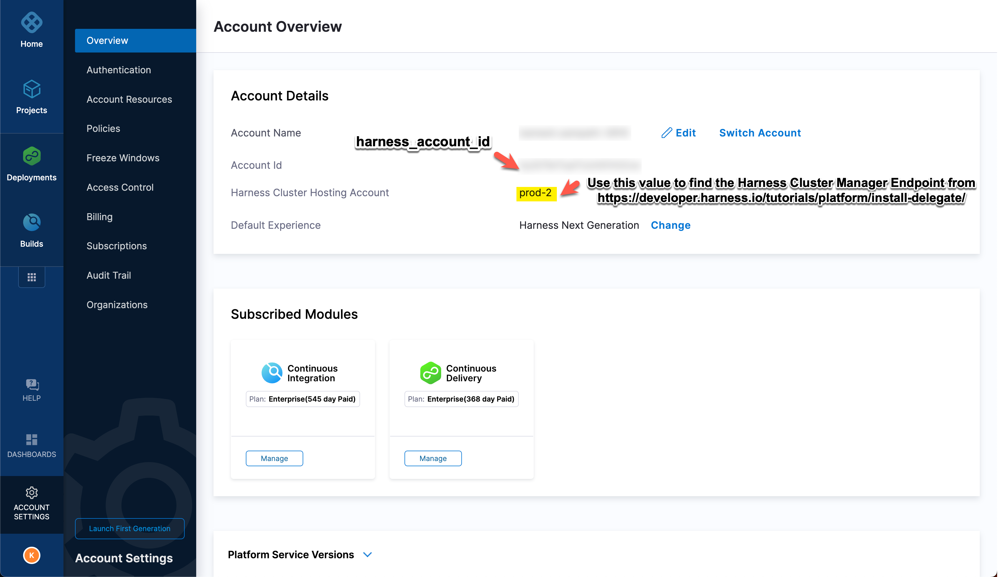
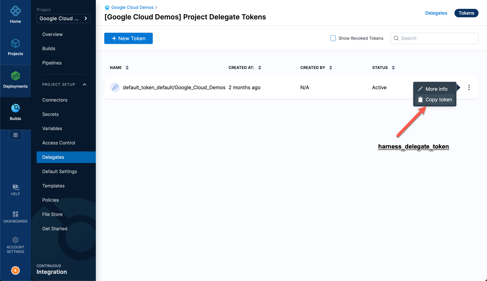
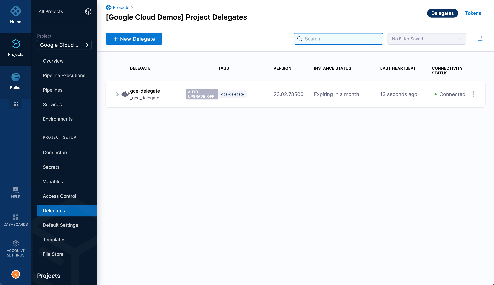
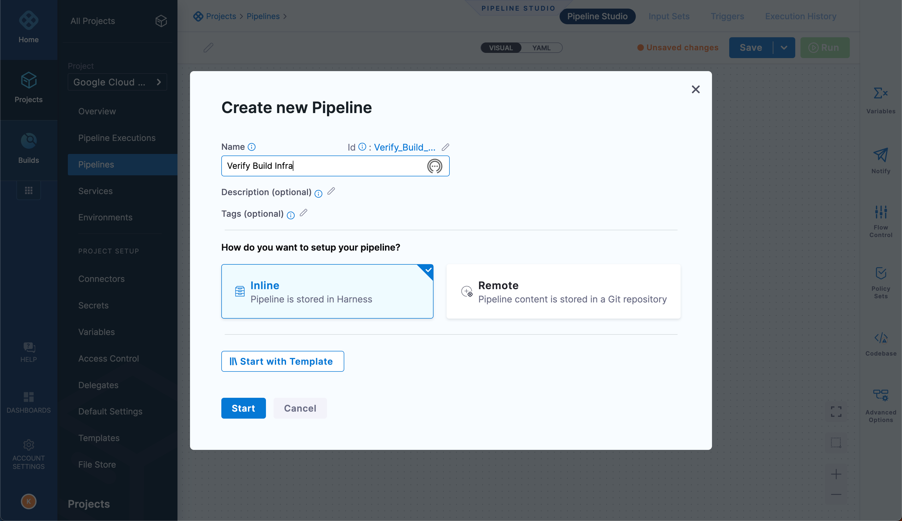
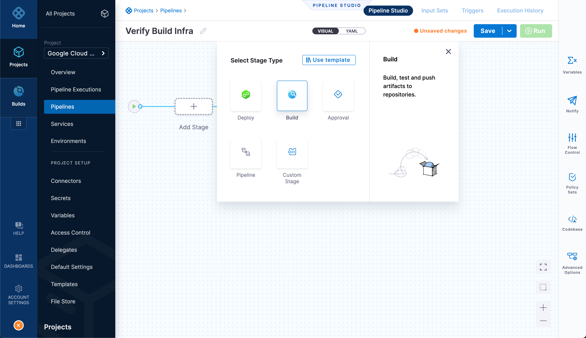
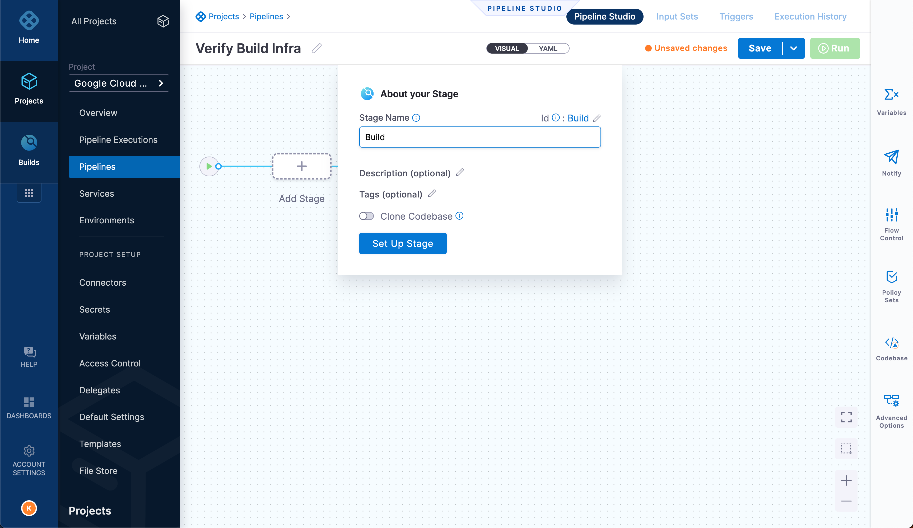
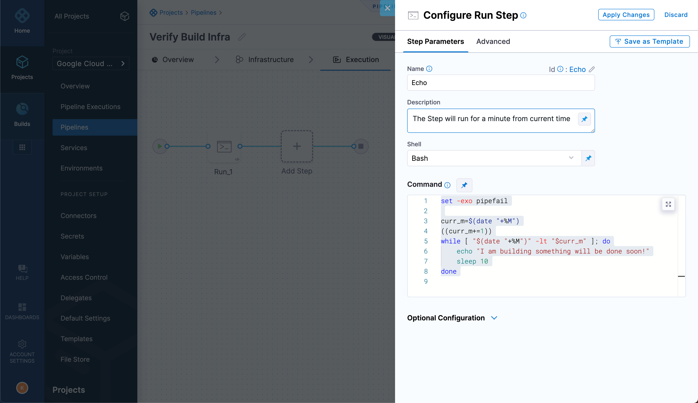
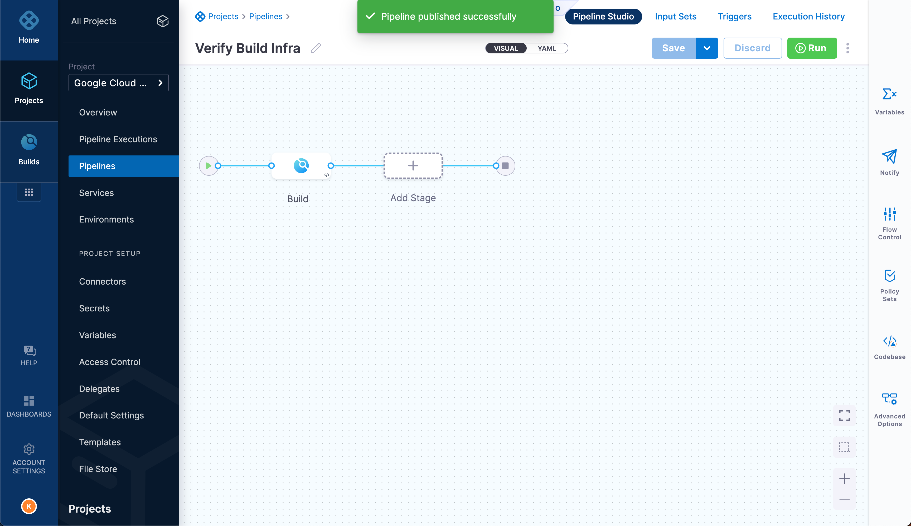
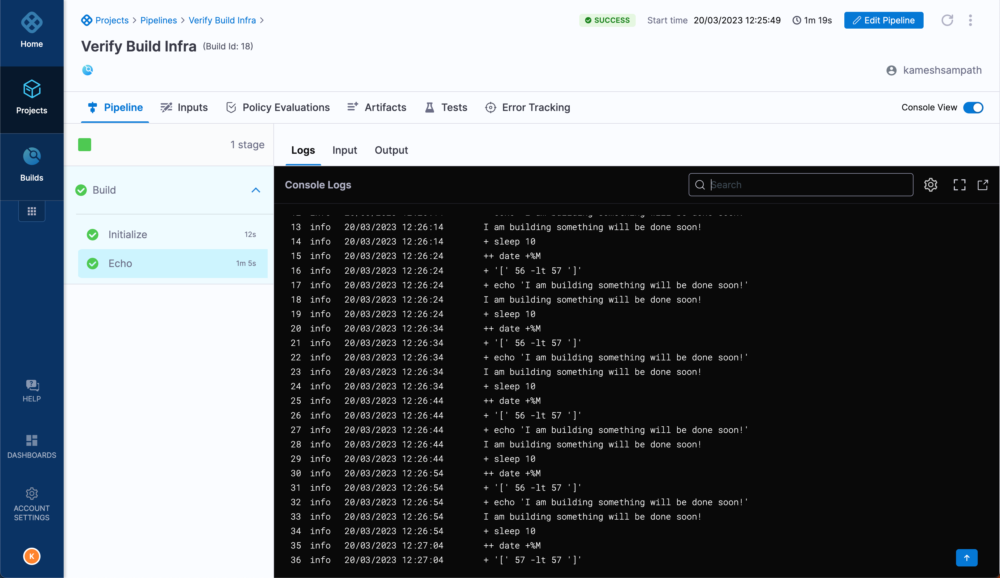

# Harness CIE GCP VM Infra

Terraform automation scripts provision and configure a [Google Cloud Platform](https://cloud.google.com) VM infrastructure to run Harness CIE builds.

> IMPORTANT
>
> Currently, this feature is behind the Feature Flag `CI_VM_INFRASTRUCTURE`. Contact [Harness Support](mailto:support@harness.io) to enable the feature.

## Pre-requisites

- [Google Cloud Account](https://cloud.google.com)
  - With a Service Account with roles
    - `Kubernetes Engine Admin` - to create GKE cluster
    - `Service Account` roles used to create/update/delete Service Account
      - iam.serviceAccounts.actAs
      - iam.serviceAccounts.get
      - iam.serviceAccounts.create
      - iam.serviceAccounts.delete
      - iam.serviceAccounts.update
      - iam.serviceAccounts.get
      - iam.serviceAccounts.getIamPolicy
      - iam.serviceAccounts.setIamPolicy
     Or simply you can add `Service Account Admin` and `Service Account User` roles
    - `Compute Network Admin`   - to create the VPC networks
- [Google Cloud SDK](https://cloud.google.com/sdk)
- [terraform](https://terraform.build)
- [Taskfile](https://taskfile.dev)

Ensure that you have the following Harness Account Details,

- Harness Account ID
- Harness Delegate Token

### Optional tools

- [direnv](https://direnv.net)

## Download Sources

Clone the sources,

```shell
git clone https://github.com/harness-apps/cie-gcp-infra.git && cd "$(basename "$_" .git)"
export PROJECT_HOME="$PWD"
```

(OR) If you are using zsh, then you can use the following commands

```shell
take  https://github.com/harness-apps/cie-gcp-infra.git
export PROJECT_HOME="$PWD"
```

## Environment Setup

### Create SSH Key Pair

Create the SSH key pair(public and private keys) that allows connecting to GCP VM via ssh,

```shell
mkdir -p "$PROJECT_HOME/.keys"
ssh-keygen -trsa -f .keys/delegate_id_rsa -C "$USER"
```

### Variables

When working with Google Cloud the following environment variables helps in setting the right Google Cloud context like Service Account Key file, project etc., You can use [direnv](https://direnv.net) or set the following variables on your shell,

```shell
export GOOGLE_APPLICATION_CREDENTIALS="the google cloud service account key json file to use"
export CLOUDSDK_ACTIVE_CONFIG_NAME="the google cloud cli profile to use"
export GOOGLE_CLOUD_PROJECT="the google cloud project to use"
```

You can find more information about gcloud cli configurations at <https://cloud.google.com/sdk/docs/configurations>.

As you may need to override few terraform variables that you don't want to check in to VCS, add them to a file called `.local.tfvars` and set the following environment variable to be picked up by terraform runs,

```shell
export TFVARS_FILE=.local.tfvars
```

>**NOTE**: All `*.local.tfvars` file are git ignored by this template.

Check the [Inputs](#inputs) section for all possible variables that are configurable.

## Inputs

| Name | Description | Type | Default | Required |
|------|-------------|------|---------|:--------:|
| <a name="input_drone_builder_image"></a> [drone\_builder\_image](#input\_drone\_builder\_image) | The VM image to use for Drone builder VM. | `string` | `"projects/ubuntu-os-cloud/global/images/ubuntu-2204-jammy-v20230302"` | no |
| <a name="input_drone_builder_machine_type"></a> [drone\_builder\_machine\_type](#input\_drone\_builder\_machine\_type) | The VM machine type to use for drone runners | `string` | `"e2-standard-4"` | no |
| <a name="input_drone_builder_pool_count"></a> [drone\_builder\_pool\_count](#input\_drone\_builder\_pool\_count) | The drone runner VM pool count | `number` | `1` | no |
| <a name="input_drone_builder_pool_limit"></a> [drone\_builder\_pool\_limit](#input\_drone\_builder\_pool\_limit) | The drone runner VM pool limit | `number` | `1` | no |
| <a name="input_drone_builder_pool_name"></a> [drone\_builder\_pool\_name](#input\_drone\_builder\_pool\_name) | The builder pool name. This pool name used in the Harness infrastructure as VM Pool Name. | `string` | `"ubuntu-jammy"` | no |
| <a name="input_drone_debug_enable"></a> [drone\_debug\_enable](#input\_drone\_debug\_enable) | Enable Drone Debug Logs | `bool` | `false` | no |
| <a name="input_drone_trace_enable"></a> [drone\_trace\_enable](#input\_drone\_trace\_enable) | Enable Drone Trace Logs | `bool` | `false` | no |
| <a name="input_harness_account_id"></a> [harness\_account\_id](#input\_harness\_account\_id) | Harness AccountID that will be used by the delegate. | `string` | n/a | yes |
| <a name="input_harness_delegate_cpu"></a> [harness\_delegate\_cpu](#input\_harness\_delegate\_cpu) | The number of cpus to set for the delegate docker runner. | `string` | `"1.0"` | no |
| <a name="input_harness_delegate_image"></a> [harness\_delegate\_image](#input\_harness\_delegate\_image) | The Harness delegate image to use | `string` | `"harness/delegate:23.02.78500"` | no |
| <a name="input_harness_delegate_memory"></a> [harness\_delegate\_memory](#input\_harness\_delegate\_memory) | The memory to set for the delegate docker runner. | `string` | `"2048m"` | no |
| <a name="input_harness_delegate_name"></a> [harness\_delegate\_name](#input\_harness\_delegate\_name) | The name to to register the delegate with your Harness Account. | `string` | `"gce-delegate"` | no |
| <a name="input_harness_delegate_token"></a> [harness\_delegate\_token](#input\_harness\_delegate\_token) | Harness Delegate token | `string` | n/a | yes |
| <a name="input_harness_delegate_vm_image"></a> [harness\_delegate\_vm\_image](#input\_harness\_delegate\_vm\_image) | The VM image to use for the delegate compute instance. | `string` | `"projects/ubuntu-os-cloud/global/images/ubuntu-2204-jammy-v20230302"` | no |
| <a name="input_machine_type"></a> [machine\_type](#input\_machine\_type) | the google cloud machine types for each cluster node. | `string` | `"n2-standard-4"` | no |
| <a name="input_project_id"></a> [project\_id](#input\_project\_id) | project id | `any` | n/a | yes |
| <a name="input_region"></a> [region](#input\_region) | the region or zone where the cluster will be created. | `string` | `"asia-south1"` | no |
| <a name="input_stop_harness_delegate"></a> [stop\_harness\_delegate](#input\_stop\_harness\_delegate) | Stop the Harness Delegate Running inside the VM. | `bool` | `false` | no |
| <a name="input_vm_name"></a> [vm\_name](#input\_vm\_name) | The delegate vm name | `string` | `"harness-cie-delegate"` | no |
| <a name="input_vm_ssh_user"></a> [vm\_ssh\_user](#input\_vm\_ssh\_user) | The SSH user for the VM. Defaults to the system user. | `string` | n/a | yes |

### Example
  
An example `.local.tfvars` that will use a Google Cloud project **my-awesome-project**, create Google Compute Engine VM named **harness-cie-delegate** in region **asia-south1**. The machine type of each cluster node will be **n2-standard-4**.

You may need to update following values with actuals from your Harness Account,

- `harness_account_id`
- `harness_delegate_token`

> **NOTE**:
> 
> - `harness_manager_endpoint` value is can be found here <https://developer.harness.io/tutorials/platform/install-delegate/>, to right endpoint check for your **Harness Cluster Hosting Account** from the Harness Account Overview page.
> In the example above my **Harness Cluster Hosting Account** is **prod-2** and its endpoint is <https://app.harness.io/gratis>
>

```hcl
project_id                 = "my-awesome-project"
region                     = "asia-south1"
harness_account_id         = "REPLACE WITH YOUR HARNESS ACCOUNT ID"
harness_delegate_token     = "REPLACE WITH YOUR HARNESS DELEGATE TOKEN"
harness_delegate_name      = "harness-cie-delegate"
```

> **NOTE**: For rest of the section we assume that your tfvars file is called `.local.tfvars`

## Tasks

The setup uses [Taskfile](https://taskfile.dev) for performing various tasks. All the available tasks can be listed using,

```shell
task --list  
```

Available tasks,

```shell
* clean:                       Clean all terraform artifacts/assets
* create_delegate_infra:       Create the Harness Delegate VM Infra      (aliases: create, delegate, infra)
* destroy:                     Destroys terraform resources
* format:                      Format terraform files
* init:                        Init terraform working directory
* readme:                      Build the README.md
* show_runners:                List all the GCP VMs that are provisioned to be run as Drone Runners      (aliases: runners)
* ssh:                         SSH into instance
* start_delegate:              Starts the Harness Delegate
* stop_delegate:               Stops the Harness Delegate
* validate:                    Validate the terraform resources
```

## Create Environment

We will use terraform to create a GCE Harness VM build infra,

```shell
task init
```
  
## Deploy Harness Delegate

Ensure you have the following values set in the `.local.tfvars` before running the `task apply` command.

- Use **Account Id** from Account Overview as the value for **harness_account_id**,



- Use the `Harness Cluster Hosting Account` from the account details to find the matching endpoint URL. e.g for `prod-2` it is <https://app.harness.io/gratis> and set that as value for `harness_manager_endpoint`.

- Copy the default token from **Projects** --> **Project Setup** --> **Delegates**(**Tokens**) and set it as value for `harness_delegate_token`.



- `harness_delegate_name`: defaults to **harness-delegate**

```shell
task create_delegate_infra
```

All the Drone runner artifacts will be created in "$PROJECT_HOME/runner". These include,

- `pool.yml`  - The Drone Runner VM pool.
- `docker-compose.yml` - The Harness Delegate Docker Compose file.
- `sa.json` - Google Service Account key to be used by Harness Delegate VM.
- `.env` - Set of environment variables that could be used with the pool vm execution.

Wait for the delegate to be connected before proceeding to next steps.

You can view status of the delegate from the **Project** --> **Project Setup** --> **Delegates** page,


  
## Build Application

Let us build an example application using the GCP VM Infra.

## Create Pipeline

Navigate to **Builds** --> **Pipelines**, click **Create Pipeline**.



Click **Add Stage**, select stage type to be **Build**



Enter details about the stage, since we are testing the infra we will skip the **Clone Codebase**,



Click **Setup Stage** to create the stage.

Select the **Infrastructure** tab and select the **Infrastructure** to be **VMs**, **Platform** to be **Linux** with **Pool Name** set to our VM infra pool **ubuntu-jammy**.


Click **Continue** to add **Step**, click **Add Step** on the **Execution** tab to add a step of type **Run** and configure the step details as shown,



The following script used as part of the build step just runs a for minute printing _I am building something will be done soon!_ at every 10 second interval.

```shell
set -exo pipefail
curr_m=$(date "+%M")
((curr_m+=1))
while [ "$(date "+%M")" -lt "$curr_m" ]; do
    echo "I am building something will be done soon!"
    sleep 10
done
```

Click **Save** to complete the Pipeline creation,



Since we have configured the pool count to be `1` in `pool.yml`, there should one runner VM created to consume builds. Run the following command to view them,

```shell
task runners
```

The command should show an output like,

```shell
NAME                                       ZONE           MACHINE_TYPE   PREEMPTIBLE  INTERNAL_IP  EXTERNAL_IP     STATUS
gcp-runner-ubuntu-jammy-hg4cfidf-ggd83  asia-south1-c  e2-standard-4               10.20.0.2    <SOME IP>  RUNNING
```

Click **Run** to run the pipeline to see the image build and pushed to GAR.


Once the pipeline starts you could a new VM(pool) being created to handle new builds and the existing VM should consume the build request.

The successful build should shown an output like,



## Outputs

| Name | Description |
|------|-------------|
| <a name="output_delegate_name"></a> [delegate\_name](#output\_delegate\_name) | The Harness Delegate Name |
| <a name="output_delegate_vm_name"></a> [delegate\_vm\_name](#output\_delegate\_vm\_name) | The Harness Delegate GCE VM Name |
| <a name="output_drone_runne_zone"></a> [drone\_runne\_zone](#output\_drone\_runne\_zone) | The Google Clound zone where runners will be provisioned and run |
| <a name="output_pool_name"></a> [pool\_name](#output\_pool\_name) | The drone builder VM pool name |
| <a name="output_project_id"></a> [project\_id](#output\_project\_id) | GCloud Project ID |
| <a name="output_region"></a> [region](#output\_region) | GCloud Region |
| <a name="output_vm_external_ip"></a> [vm\_external\_ip](#output\_vm\_external\_ip) | The external IP to access the VM |
| <a name="output_vm_ssh_user"></a> [vm\_ssh\_user](#output\_vm\_ssh\_user) | The SSH username to login into VM |
| <a name="output_zone"></a> [zone](#output\_zone) | VM Instance Zone |

## Cleanup

Run the following command to cleanup the infrastructure,

```shell
task destroy
```

## References

- [Harness CI](https://app.harness.io/auth/#/signup/?module=ci?utm_source=internal&utm_medium=social&utm_campaign=community&utm_content=kamesh-github&utm_term=diy-demos)
- [Developer Hub](https://developer.harness.io)
- [Harness Delegate](https://developer.harness.io/tutorials/platform/install-delegate/)
- [GCP VM Build Infra](https://developer.harness.io/docs/continuous-integration/use-ci/set-up-build-infrastructure/vm-build-infrastructure/define-a-ci-build-infrastructure-in-google-cloud-platform/)

## License

[Apache License](./../LICENSE)
